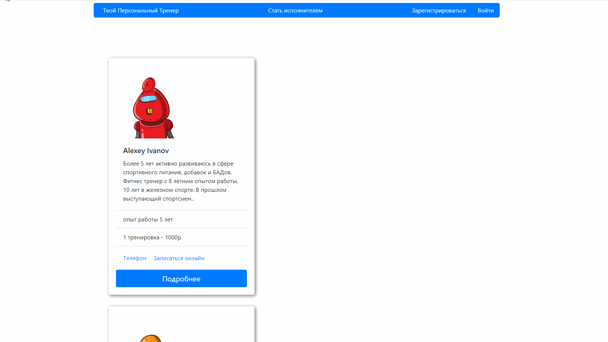

# Сервис для поиска персонального фитнесс тренера # 

Функционал сервиса предполагает возможность тренеру создать личную страницу с описанием своих профессиональных навыков и ценовыми предложениями, а пользователь-клиент может просматривать информацию о тренерах, получать контактные данные или напрямую оставлять заявки.

Данный проект разрабатывается в рамках обучения front-end разработке и освоения React.js, HTML, CSS, Redux, Typescript.

